# Sistema de Quizzes e Compras — Arquitetura

- Projeto: aplicação de quizzes com recompensa financeira e compras de créditos.
- Baseado no conteúdo dos slides desta mesma codebase (componentes e diagramas).

## Sumário
- Visão Geral
- Características Arquiteturais (Top 4) + Táticas
- Estilo Arquitetural (com justificativa)
- Componentes Candidatos e Responsabilidades
- Diagramas (Componentes, Módulos e Internos Críticos)
- Decisões Arquiteturais (ADRs)
- Telas da Aplicação

## Visão Geral
O sistema permite que usuários disputem quizzes, visualizem rankings, comprem créditos via PIX e recebam notificações sobre novos quizzes. Há uma área administrativa (CMS) para gestão de conteúdo (times, perguntas, respostas e quizzes) e um núcleo operacional (Operador/BFF) que orquestra regras de negócio e integrações com Autenticação, Pagamentos e Analytics/Notificações.

## Características Arquiteturais (Top 4)

### 1) Disponibilidade
O sistema deve permanecer online de forma contínua para permitir que os usuários participem de quizzes e realizem compras. Como a resposta ao quiz concentra grande volume de acessos em janelas curtas, a disponibilidade torna-se crítica para evitar interrupções na experiência e perda de receita (ligado a REQ 06, 07, 13 e 15 nos slides).

- Táticas:
  - Health checks e alertas de latência nos endpoints críticos.
  - Uso de provedores gerenciados para reduzir MTTR (Auth, Pagamentos, Analytics).
  - Timeouts no Operador ao integrar serviços externos.

### 2) Elasticidade
Notificações sobre início/encerramento de quiz e janelas curtas de realização podem provocar picos de tráfego. A arquitetura precisa escalar automaticamente para absorver fluxos intensos em curtos períodos, bem como retrair após o pico para eficiência de custos.

- Táticas:
  - Observabilidade (métricas e dashboards) para identificar gargalos e dimensionar recursos.
  - Cache para conteúdos de leitura com baixa taxa de modificação (CDN/Redis).
  - Desacoplamento de serviços críticos e uso de serviços gerenciados com escala horizontal.

### 3) Manutenibilidade
É essencial operar e evoluir a solução com baixo custo de suporte. Módulos com responsabilidades claras, contratos estáveis e observabilidade aceleram correções e suporte.

- Táticas:
  - Adoção de provedores genéricos/gerenciados para domínios não diferenciais (Auth, CMS, Pagamentos, Analytics).
  - CI/CD simples com rollback rápido e versionamento de contratos.
  - Telemetria e Monitoramento de Erros para reduzir MTTR.

### 4) Autenticação e Autorização
O sistema autentica usuários e aplica regras de autorização por perfil (usuário/admin). Autenticação de usuários finais é delegada a um provedor gerenciado; admins usam o módulo do CMS.

- Táticas:
  - Provedor gerenciado de autenticação. 
  - Escopos por contexto (cliente x admin).

## Estilo Arquitetural (com justificativa)
- Estilo: Monolitíco Modular para o domínio principal (Operador/BFF) + Integração com Serviços Gerenciados (Auth, Pagamentos, Analytics) + FrontEnd PWA. O CMS administrativo é um monólito opinativo acoplado ao seu próprio banco.
- Justificativa: o domínio do quiz é coeso e beneficia-se de consistência transacional e simplicidade operacional, enquanto capacidades não diferenciais (login, cobrança, métricas) são melhor atendidas por serviços gerenciados, reduzindo tempo de implementação e esforço de manutenção, além de fornecer elasticidade.

## Componentes Candidatos e Responsabilidades

1) CMS Administrativo
- Gestão de conteúdo: times, perguntas, respostas, quizzes e configurações.
- Autenticação de administradores pelo próprio CMS; banco de dados acoplado.
- Expõe API somente para o conteúdo publicado.

2) Notificações & Analytics
- Notificações push (ex.: início de quiz) e coleta de eventos (jogou, respondeu, finalizou).
- Dashboards, públicos e funis; integra com Operador e Autenticação.

3) Provedor de Autenticação
- Cadastro/login, recuperação de senha, emissão de tokens e perfis básicos de usuários finais.
- Integra com FrontEnd, Operador e Notificações (tokens de push).

4) Provedor de Pagamentos 
- Criação de ordens, confirmação via webhooks idempotentes e reconciliação (30% ao vencedor).
- Relatórios financeiros e antifraude; integra com o Operador.

5) Sistema de Operações (BFF/API & Core)
- Orquestra regras de negócio: sessão de quiz, fechamento, pontuação, ranking, convites, materializações de dashboard.
- Integra CMS, Auth, Pagamentos e Analytics; mantém estado transacional do domínio.

6) FrontEnd (Ionic/React PWA)
- Experiência do usuário: autenticação, jogar quiz, ver ranking, pagar, receber push.
- Consome Operador (APIs), Auth (login), Pagamentos (checkout) e Analytics.

## Diagrama de Componentes (Geral)

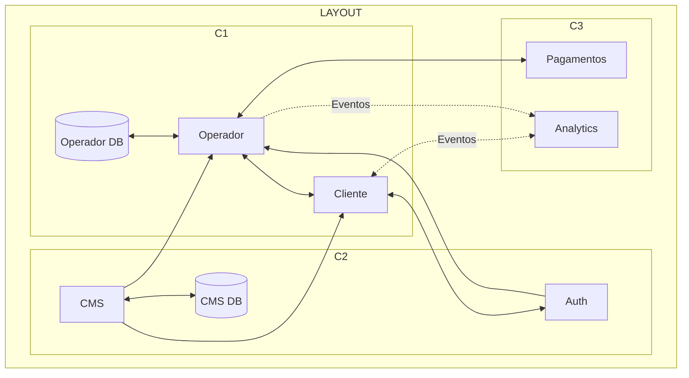

## Componentes Internos Críticos (≥30%) e Justificativa
- Operador (Core de domínio):
  - Abertura/Fechamento de Quiz, Sessão de Quiz, Pontuações, Convites, Materializações de Dashboard, Proxy para micro-serviços externos, Criação/Recepção de Transações.
  - Justificativa: concentra regras temporais (janelas de quiz), consistência de pontuação e integração financeira
- Cliente (PWA):
  - Autenticação, Cadastro, Rankings, Lista/Sessão de Quiz, Lista de Times, Criação/Confirmação de Pagamentos, Dashboard.
  - Justificativa: principal superfície de tráfego e percepção de qualidade; requer caching.
- CMS: Quizzes, Respostas, Times, Perguntas, Autenticação de Admin e FrontEnd do CMS.
  - Justificativa: governança do conteúdo.

### Diagrama — Operador (internos críticos)
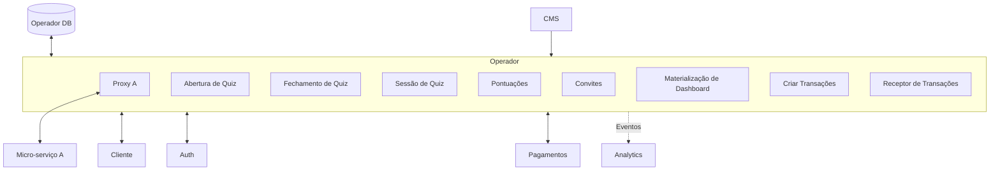

### Diagrama — Cliente (telas e módulos)
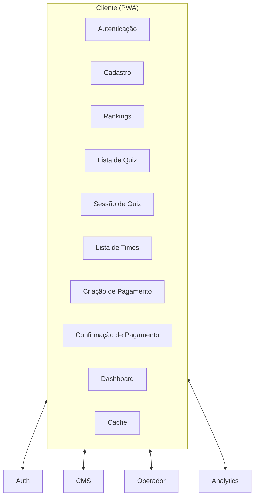

### Diagrama — CMS (módulos internos)
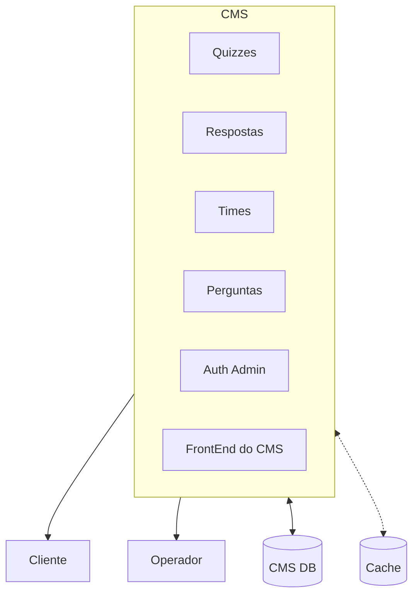

### Diagrama — Autenticação (módulos internos)
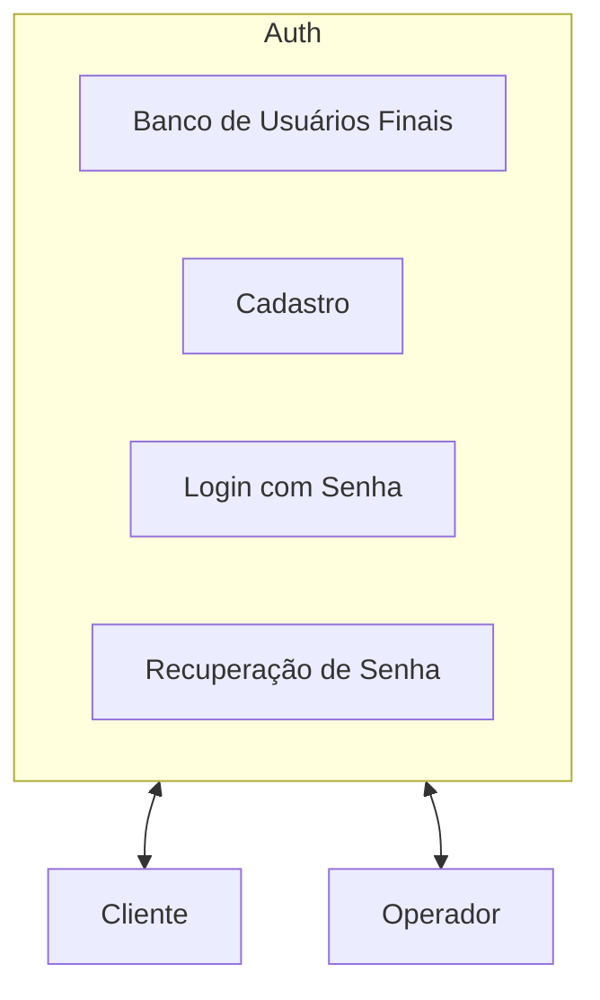

### Diagrama — Pagamentos (módulos internos)
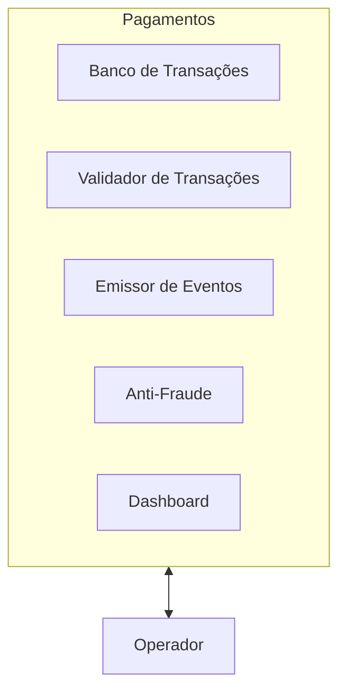

### Diagrama — Notificações/Analytics
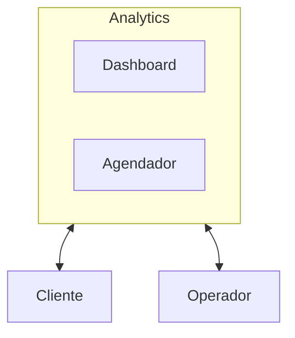

## Diagrama de Módulos (Pacotes/UML)
Representação dos módulos por domínio (DDD), agrupando domínios principais e genéricos.

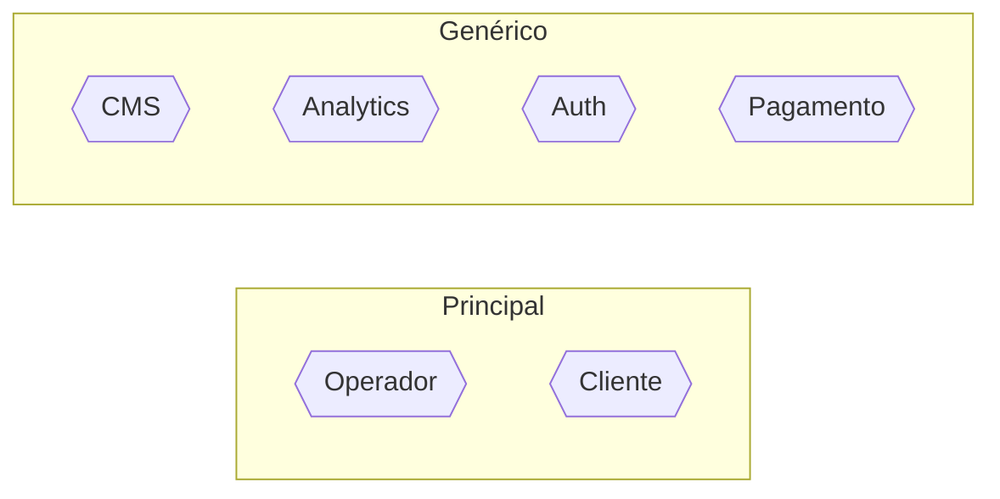

## Decisões Arquiteturais (ADRs)

- ADR-001 — Top 4 Características
    - Contexto: priorizar as características mais importantes usando os requisitos como base.
    - Decisão: priorizar Disponibilidade, Elasticidade, Manutenibilidade e Autenticação/Autorização.
    - Consequências: buscar táticas e filtrar soluções que atendam essas características, mesmo que impactem outras menos prioritárias.
    - 
- ADR-002 — Arquitetura DDD
    - Contexto: delimitar o esforço de desenvolvimento e manutenção focando nos recursos diferenciais.
    - Decisão: adotar DDD para o domínio principal (Operador/BFF) e usar serviços gerenciados para capacidades genéricas (Auth, Pagamentos, Analytics, CMS)
    - Consequências: buscar soluções prontas para domínios genéricos, reduzindo esforço de desenvolvimento e manutenção; foco no core do negócio.

- ADR-003 — Estilo Arquitetural
  - Contexto: modelagem do sistema considerando os domínios principais e genéricos identificados.
  - Decisão: Monolito Modular para Operador + serviços gerenciados para capacidades genéricas
  - Consequências: simplicidade operacional e consistência transacional no core; elasticidade e redução de manutenção em domínios genéricos.

- ADR-004 — Monitoramento e Observabilidade
  - Contexto: janelas de pico, necessidade de diagnóstico rápido.
  - Decisão: coletar métricas e eventos (Analytics), logs e erros (error monitoring), dashboards e alertas.
  - Consequências: Detecção mais rápida de incidentes e melhor dimensionamento de recursos com dados concretos; evitar super escalonamento e novos componentes arquitetural sem uma clara justificativa

- ADR-005 — FrontEnd em PWA e/ou Cross-Platform
  - Contexto: diversidade de dispositivos e necessidade de boa experiência com baixo custo.
  - Decisão: adotar PWA (Ionic/React) para atender múltiplas plataformas com uma única base de código
  - Consequências: menor custo de desenvolvimento e manutenção, boa experiência em dispositivos móveis e desktop, possível limitação em funcionalidades nativas.

## Telas da Aplicação
Conjunto de telas derivadas dos módulos do Cliente (PWA):
- Autenticação e Cadastro
- Lista de Quiz e Sessão de Quiz
- Rankings e Lista de Times
- Criação e Confirmação de Pagamento
- Dashboard do Usuário

Fluxo simplificado das telas:
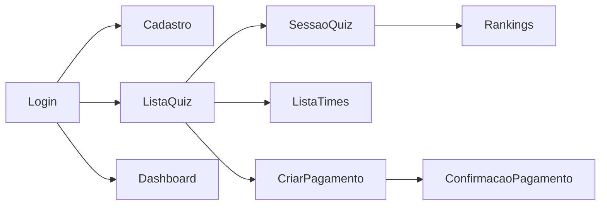

## Telas do MVP

Referências às imagens das telas (pasta `images/`):
- Login: `images/login.jpeg`
- Menu Principal: `images/main_menu.jpeg`
- Quiz: `images/quiz.jpeg`
- Ranking: `images/ranking.jpeg`
- Pagamento de Créditos: `images/credit_pay.jpeg`

Prévia visual (amostras):

  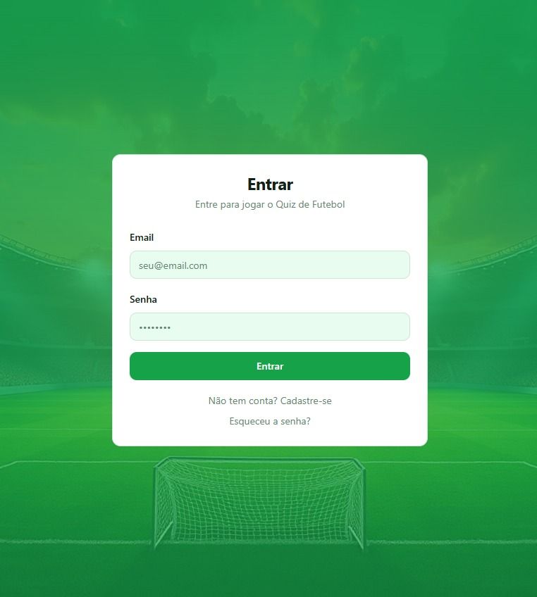
  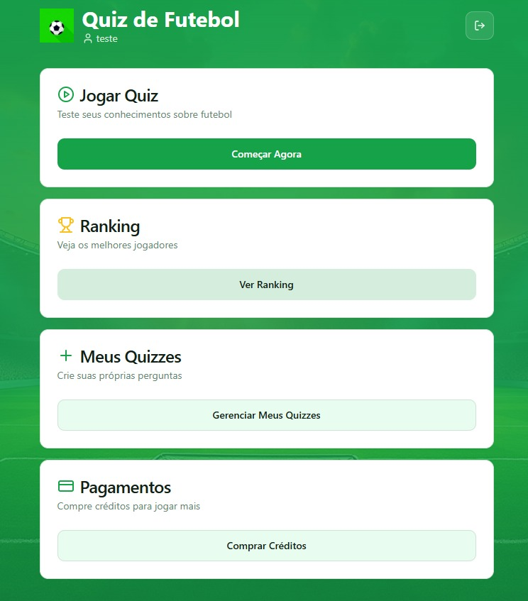
   
  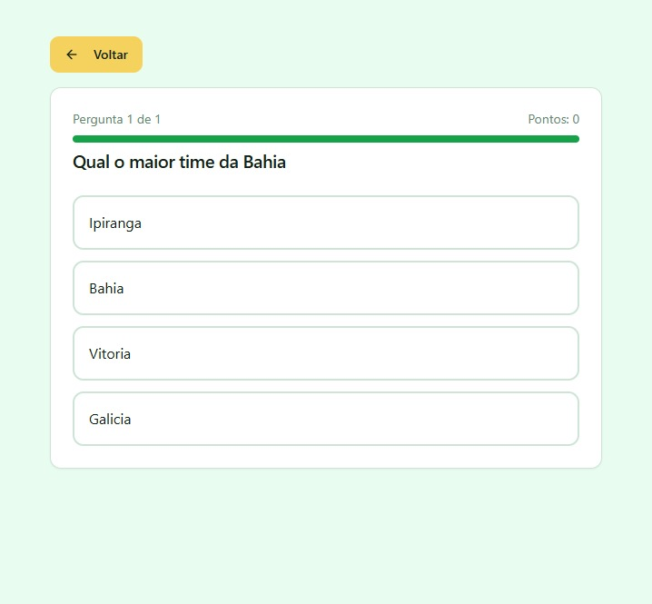
  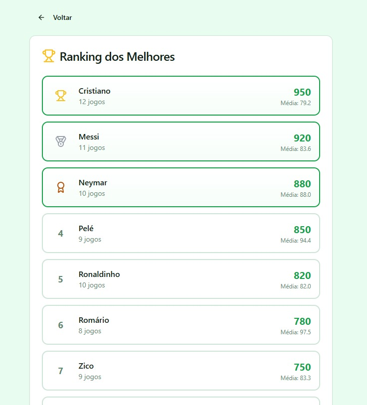
   
  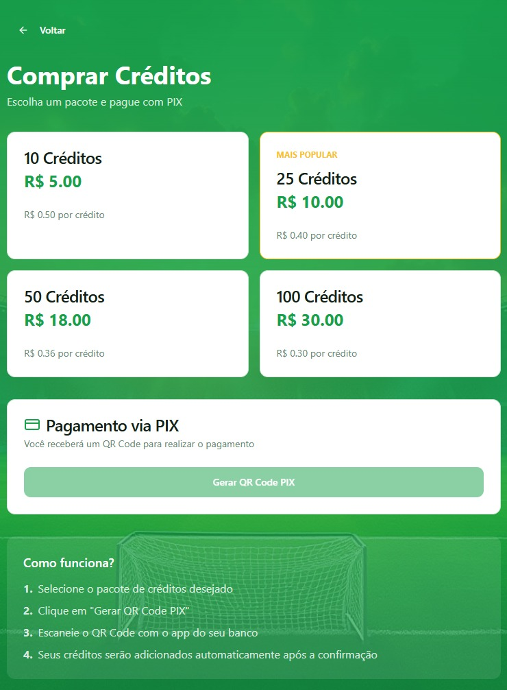
  

