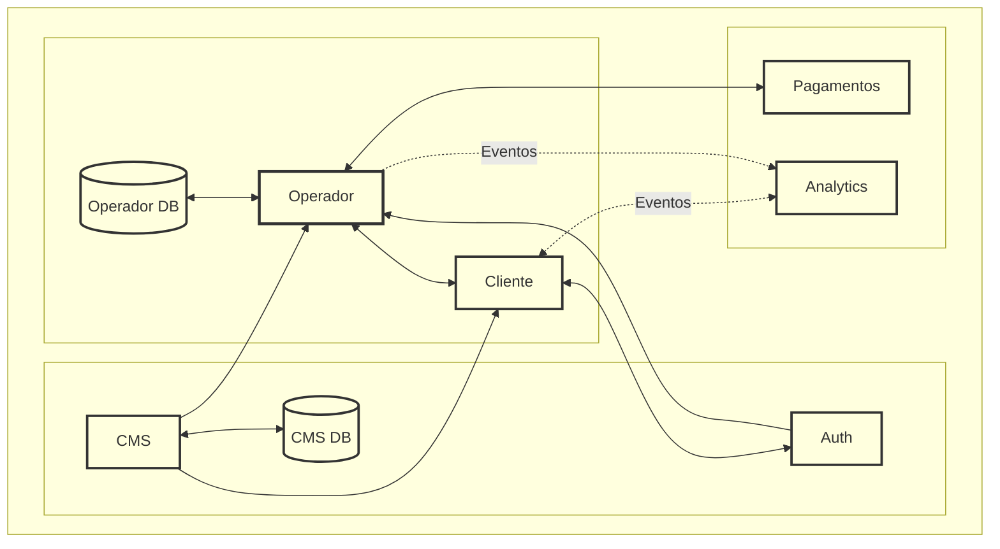
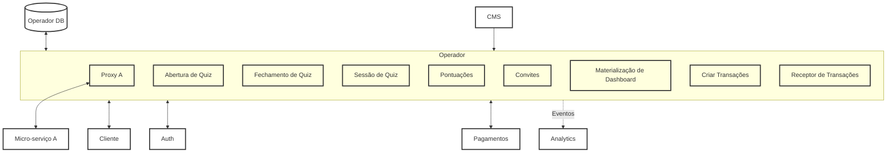
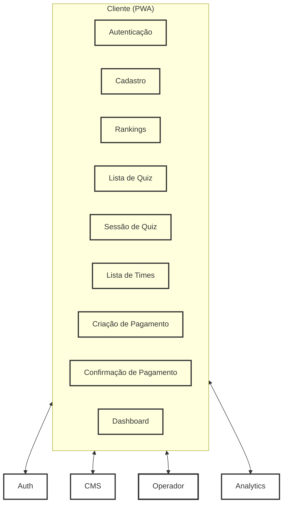
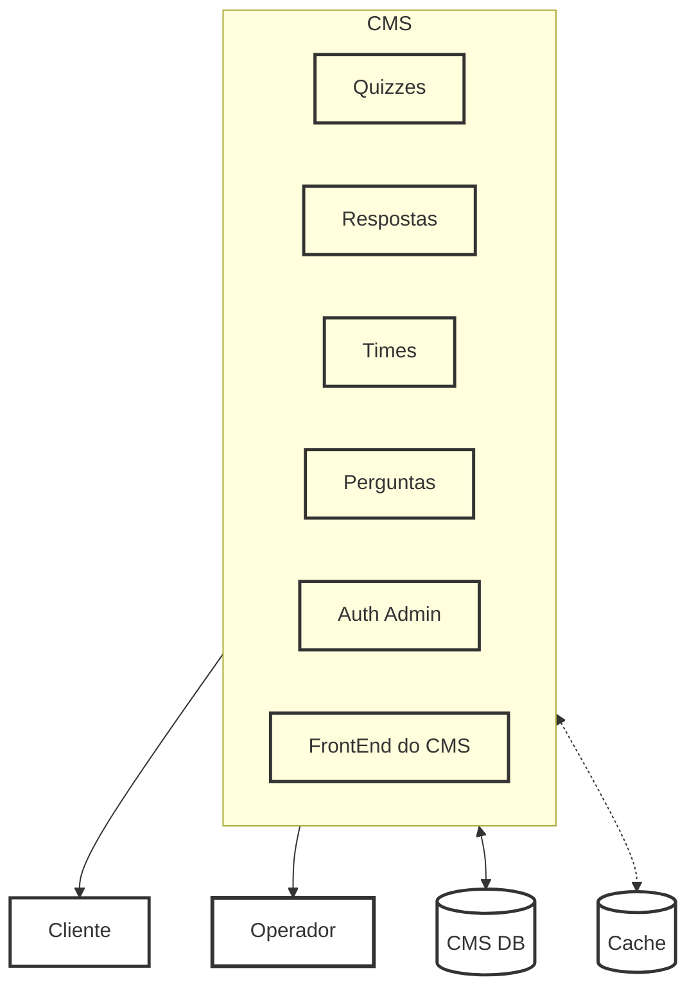
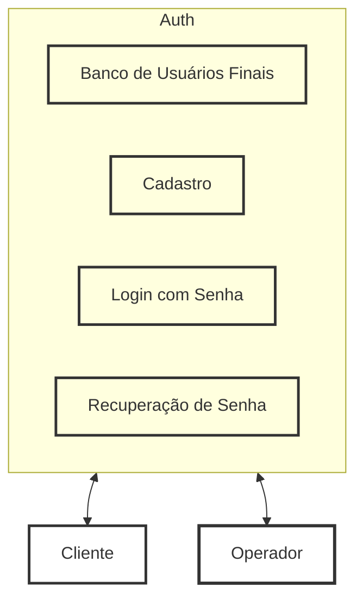
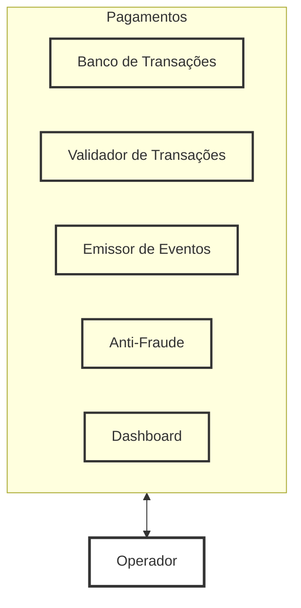
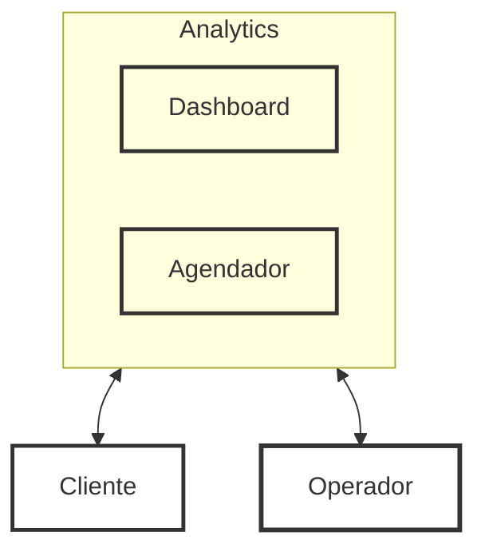
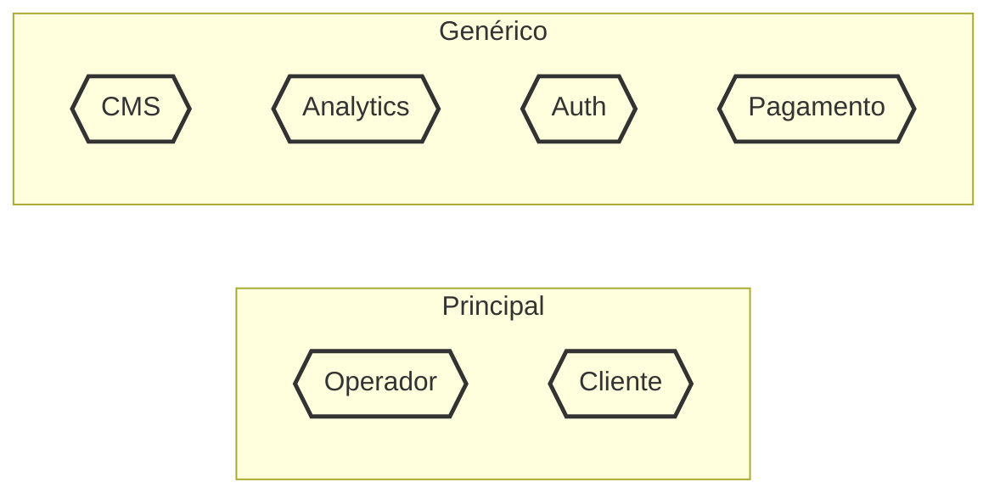
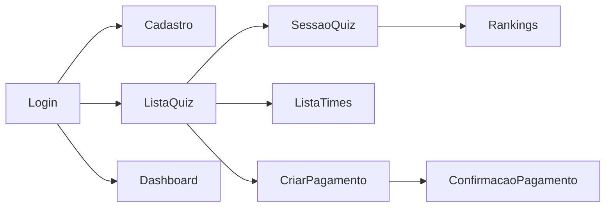

# Sistema de Quizzes e Compras — Arquitetura

- Projeto: aplicação de quizzes com recompensa financeira e compras de créditos.
- Baseado no conteúdo dos slides desta mesma codebase (componentes e diagramas).

## Sumário
- Visão Geral
- Características Arquiteturais (Top 4) + Táticas
- Estilo Arquitetural (com justificativa)
- Componentes Candidatos e Responsabilidades
- Diagramas (Componentes, Módulos e Internos Críticos)
- Decisões Arquiteturais (ADRs)
- Telas da Aplicação

## Visão Geral
O sistema permite que usuários disputem quizzes, visualizem rankings, comprem créditos via PIX e recebam notificações sobre novos quizzes. Há uma área administrativa (CMS) para gestão de conteúdo (times, perguntas, respostas e quizzes) e um núcleo operacional (Operador/BFF) que orquestra regras de negócio e integrações com Autenticação, Pagamentos e Analytics/Notificações.

## Características Arquiteturais (Top 4)

### 1) Disponibilidade
O sistema deve permanecer online de forma contínua para permitir que os usuários participem de quizzes e realizem compras. Como a resposta ao quiz concentra grande volume de acessos em janelas curtas, a disponibilidade torna-se crítica para evitar interrupções na experiência e perda de receita (ligado a REQ 06, 07, 13 e 15 nos slides).

- Táticas:
  - Health checks e alertas de latência nos endpoints críticos.
  - Uso de provedores gerenciados para reduzir MTTR (Auth, Pagamentos, Analytics).
  - Circuit breakers e timeouts no Operador ao integrar serviços externos.

### 2) Elasticidade
Notificações sobre início/encerramento de quiz e janelas curtas de realização podem provocar picos de tráfego. A arquitetura precisa escalar automaticamente para absorver fluxos intensos em curtos períodos, bem como retrair após o pico para eficiência de custos.

- Táticas:
  - Observabilidade (métricas e dashboards) para identificar gargalos e dimensionar recursos.
  - Cache para conteúdos de leitura com baixa taxa de modificação (CDN/Redis).
  - Desacoplamento de serviços críticos e uso de serviços gerenciados com escala horizontal.

### 3) Manutenibilidade
É essencial operar e evoluir a solução com baixo custo de suporte. Módulos com responsabilidades claras, contratos estáveis e observabilidade aceleram correções e suporte.

- Táticas:
  - Adoção de provedores genéricos/gerenciados para domínios não diferenciais (Auth, CMS, Pagamentos, Analytics).
  - CI/CD simples com rollback rápido e versionamento de contratos.
  - Telemetria e error monitoring (por exemplo, Sentry) para reduzir MTTR.

### 4) Autenticação e Autorização
O sistema autentica usuários e aplica regras de autorização por perfil (usuário/admin). Autenticação de usuários finais é delegada a um provedor gerenciado; admins usam o módulo do CMS.

- Táticas:
  - Provedor gerenciado de autenticação (ex.: Firebase Auth) com tokens de ID.
  - Escopos por contexto (cliente x admin) e verificação no Operador.
  - Políticas de expiração/renovação de sessão e MFA opcional.

## Estilo Arquitetural (com justificativa)
- Estilo: Modular Monolith para o domínio principal (Operador/BFF) + Integração com Serviços Gerenciados (Auth, Pagamentos, Analytics) + FrontEnd PWA. O CMS administrativo é um monólito opinativo acoplado ao seu próprio banco.
- Justificativa: o domínio do quiz é coeso e beneficia-se de consistência transacional e simplicidade operacional, enquanto capacidades não diferenciais (login, cobrança, métricas) são melhor atendidas por serviços gerenciados, reduzindo tempo de implementação e esforço de manutenção, além de fornecer elasticidade e SLAs nativos.

## Componentes Candidatos e Responsabilidades

1) CMS Administrativo (Strapi/FireCMS)
- Gestão de conteúdo: times, perguntas, respostas, quizzes e configurações.
- Autenticação de administradores pelo próprio CMS; banco de dados acoplado.
- Expõe API somente para o Operador consumir conteúdo publicado.

2) Notificações & Analytics (Firebase/GA)
- Notificações push (ex.: início de quiz) e coleta de eventos (jogou, respondeu, finalizou).
- Dashboards, públicos e funis; integra com Operador e Autenticação.

3) Provedor de Autenticação (ex.: Firebase Auth)
- Cadastro/login, recuperação de senha, emissão de tokens e perfis básicos de usuários finais.
- Integra com FrontEnd, Operador e Notificações (tokens de push).

4) Provedor de Pagamentos (ex.: Mercado Pago/Stripe)
- Criação de ordens, confirmação via webhooks idempotentes e reconciliação (30% ao vencedor).
- Relatórios financeiros e antifraude; integra com o Operador.

5) Sistema de Operações (BFF/API & Core)
- Orquestra regras de negócio: sessão de quiz, fechamento, pontuação, ranking, convites, materializações de dashboard.
- Integra CMS, Auth, Pagamentos e Analytics; mantém estado transacional do domínio.

6) FrontEnd (Ionic/React PWA)
- Experiência do usuário: autenticação, jogar quiz, ver ranking, pagar, receber push.
- Consome Operador (APIs), Auth (login), Pagamentos (checkout) e Analytics.

## Diagrama de Componentes (Geral)

## Componentes Internos Críticos (≥30%) e Justificativa
- Operador (Core de domínio):
  - Abertura/Fechamento de Quiz, Sessão de Quiz, Pontuações, Convites, Materializações de Dashboard, Proxy para micro-serviços externos, Criação/Recepção de Transações.
  - Justificativa: concentra regras temporais (janelas de quiz), consistência de pontuação e integração financeira; impacto direto em disponibilidade, elasticidade e manutenibilidade.
- Cliente (PWA):
  - Autenticação, Cadastro, Rankings, Lista/Sessão de Quiz, Lista de Times, Criação/Confirmação de Pagamentos, Dashboard.
  - Justificativa: principal superfície de tráfego e percepção de qualidade; requer caching e telemetria.
- CMS: Quizzes, Respostas, Times, Perguntas, Autenticação de Admin e FrontEnd do CMS.
  - Justificativa: governança do conteúdo e confiabilidade editorial.

### Diagrama — Operador (internos críticos)

### Diagrama — Cliente (telas e módulos)

### Diagrama — CMS (módulos internos)

### Diagrama — Autenticação (módulos internos)

### Diagrama — Pagamentos (módulos internos)

### Diagrama — Notificações/Analytics

## Diagrama de Módulos (Pacotes/UML)
Representação dos módulos por domínio (DDD), agrupando domínios principais e genéricos.

## Táticas por Característica

- Disponibilidade: health checks e SLOs por endpoint; timeouts e retries com backoff; fail-fast em integrações externas.
- Elasticidade: escalonamento automático, cache de leitura e compressão; filas/eventos para desacoplamento quando aplicável.
- Manutenibilidade: modularização por contexto; contratos versionados; CI/CD com canary/rollback; observabilidade distribuída.
- Autenticação/Autorização: tokens com escopos e validade; segregação de contexto (admin x cliente); MFA opcional.

## Decisões Arquiteturais (ADRs)

- ADR-001 — Estilo Arquitetural
  - Contexto: regras de negócio de quiz coesas, integrações diversas (Auth, Pagamentos, Analytics, CMS).
  - Decisão: Modular Monolith para Operador + serviços gerenciados para capacidades genéricas; FrontEnd como PWA.
  - Consequências: consistência transacional no core; menor esforço operacional nos genéricos; dependência de terceiros com SLAs.

- ADR-002 — Top 4 Características
  - Contexto: requisitos funcionais (REQ 06, 07, 13, 15, 17) expostos nos slides.
  - Decisão: priorizar Disponibilidade, Elasticidade, Manutenibilidade e Autenticação/Autorização.
  - Consequências: seleção de serviços gerenciados, ênfase em observabilidade e táticas de resiliência.

- ADR-003 — Autenticação Gerenciada
  - Contexto: necessidade de login, recuperação de senha, tokens e integração com push.
  - Decisão: usar provedor gerenciado (ex.: Firebase Auth) para usuários finais; admins via CMS.
  - Consequências: redução de manutenção e riscos de segurança; dependência do fornecedor.

- ADR-004 — Pagamentos Externos com Webhooks Idempotentes
  - Contexto: compra de créditos via PIX e repasse de 30% ao vencedor.
  - Decisão: integrar provedor de pagamentos (ex.: Mercado Pago/Stripe) com webhooks idempotentes.
  - Consequências: confiabilidade na reconciliação; maior segurança; taxas por transação.

- ADR-005 — Observabilidade e Telemetria
  - Contexto: janelas de pico, necessidade de diagnóstico rápido.
  - Decisão: coletar métricas e eventos (Analytics), logs e erros (error monitoring), dashboards e alertas.
  - Consequências: detecção mais rápida de incidentes e melhor dimensionamento.

## Telas da Aplicação
Conjunto de telas derivadas dos módulos do Cliente (PWA):
- Autenticação e Cadastro
- Lista de Quiz e Sessão de Quiz
- Rankings e Lista de Times
- Criação e Confirmação de Pagamento
- Dashboard do Usuário

Fluxo simplificado das telas:

---

Observação: Este README foi enriquecido a partir do conteúdo dos slides presentes no projeto (componentes, justificativas e diagramas), mantendo os temas e escopo originais.
